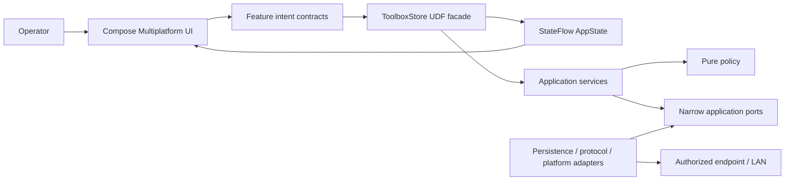

# Architecture

## Architectural intent

IoT Offline Toolbox is a local-first Compose Multiplatform operator application. It has no application backend; network traffic is initiated only toward endpoints explicitly chosen by the operator. The architecture is optimized for explicit trust boundaries, deterministic application policy, one-way state publication, replaceable adapters, structured cancellation, and reviewable changes without unnecessary framework ceremony.

The concrete style is **UDF + ports/adapters + cohesive application services**. The architecture is judged by dependency direction and runtime ownership, not by folder names or pattern labels.

## System context



## Dependency direction

```text
Compose UI
    -> ToolboxActions + immutable AppState

ToolboxStore
    -> cohesive application services
    -> narrow ports / pure policy / immutable models

Application services
    -> core/port
    -> core/policy
    -> core/security
    -> core/model

Outer adapters
    core/data      -> core/port + core/model + core/security
    core/network   -> core/port + core/policy + core/model + core/security
    platform actuals -> core/port NetworkProbe + protocol/policy code

ToolboxComposition
    -> constructs concrete adapters and the owned runtime scope
```

`tools/architecture_audit.py` rejects the important reverse directions. Models and ports cannot depend on adapters or UI; UI cannot import data/network adapters; application orchestration cannot import Compose, Android, UIKit, Java networking, or Java I/O; and pure policy cannot depend on Ktor or platform APIs.

## Production composition root and lifecycle ownership

`ToolboxComposition.kt` is the production composition root. It creates:

- `ToolboxRepository`;
- the platform `NetworkProbe`;
- HTTP, WebSocket, MQTT-over-WebSocket, and CoAP adapters;
- one `MainScope` whose ownership is transferred to `ToolboxStore`;
- one shared `ToolboxRuntime` clock/ID boundary used by both application policy and repository timestamps.

Concrete adapters are not constructed in `ToolboxStore`. `App()` creates the Store once with `remember` and closes it through `DisposableEffect`; the Store closes the coordinator, probe, protocol clients, and owned scope.

## UDF presentation boundary

`AppState` is an immutable application snapshot published as `StateFlow<AppState>`. Compose observes it and emits named intents. Presentation does not receive persistence implementations, Ktor clients, sockets, clocks, or random generators.

The public intent surface is segregated by feature:

- `NavigationActions`;
- `DiagnosticsActions`;
- `ProtocolActions`;
- `PayloadActions`;
- `OperationActions`;
- `DeviceInventoryActions`;
- `ProfileInventoryActions`;
- `TemplateInventoryActions`;
- `SettingsAndBackupActions`.

`ToolboxActions` aggregates these interfaces for the application shell, while individual screen parameters remain callback-oriented and do not depend on the concrete Store.

`ToolboxStore` is intentionally a small facade. It owns the single mutable `StateFlow`, atomic publication via `MutableStateFlow.update`, resource lifecycle, and delegation. Navigation persistence is delegated to `ToolboxNavigationManager`; network, inventory, backup, logging, and recovery policy do not live in the facade.

## Application services

### Operation lifecycle - `ToolboxOperationRunner`

Centralizes the common lifecycle for user-triggered operations:

- serialized launch/cancel ordering through `OperationCoordinator`;
- busy-state publication;
- stale-operation suppression;
- capability gating;
- application cleartext policy;
- bounded/redacted failures;
- history and log publication.

Cancellation is rethrown, not converted to an ordinary operation failure.

### Diagnostics - `ToolboxDiagnosticsOperations`

Owns diagnostic use cases only:

- subnet calculation;
- ping and DNS resolution;
- TCP/UDP exchange;
- bounded port scanning;
- LAN discovery;
- SSDP and mDNS discovery.

It depends on the `NetworkProbe` port and pure parsing/policy helpers, not platform socket implementations.

### Protocols - `ToolboxProtocolOperations`

Owns request/response protocol orchestration for:

- HTTP;
- WebSocket;
- MQTT over WebSocket;
- CoAP.

It depends on protocol-client ports and the shared operation runner. Transport engines remain outer adapters.

### Payload - `ToolboxPayloadOperations`

Owns payload transformation use cases and publication of bounded transformation results.

### Inventory services

Inventory is split by aggregate rather than hidden behind a generic manager:

- `ToolboxDeviceInventory`;
- `ToolboxProfileInventory`;
- `ToolboxTemplateInventory`.

`ToolboxInventoryContext` contains only shared policy dependencies: state access, update publication, validation feedback, journal access, clock/ID, and common limits. Each inventory service owns its own normalization, redaction, persistence, and duplicate/update semantics.

### Activity journal - `ToolboxActivityJournal`

Owns:

- secret redaction;
- bounded log/history previews;
- retention;
- durable activity writes;
- controlled storage-failure feedback and an in-memory fallback diagnostic.

It depends only on `ActivityPersistence`, not the full persistence adapter contract.

### Settings and backup - `ToolboxSettingsManager`

Owns settings mutation, backup export/inspection/import, persistent-state reload after restore, retention application, and clear-history/log use cases. It depends on the use-case-specific `SettingsBackupPersistence` aggregate because backup restore legitimately touches every durable collection.

### Initial state - `ToolboxStateLoader`

Loads all durable collections before draining recovery evidence. Corrupt-storage events are defensively redacted and converted into bounded recovery logs plus one typed notice. It depends on the read-only `ToolboxSnapshotReader` contract.

### Navigation - `ToolboxNavigationManager`

Persists the last route through `SettingsPersistence` and publishes controlled feedback when durable navigation settings cannot be saved. It deliberately keeps persistence behavior out of the UDF facade.

### Runtime - `ToolboxRuntime`

Provides deterministic boundaries for:

- time (`ToolboxClock`);
- ID generation (`ToolboxIdGenerator`).

Direct application-policy calls to the system clock or random generator are forbidden by architecture checks.

## Ports and interface segregation

Application-facing contracts live in `core/port`.

Network/protocol ports:

- `NetworkProbe`;
- `HttpOperationClient`;
- `WebSocketOperationClient`;
- `MqttOperationClient`;
- `CoapOperationClient`.

Persistence is intentionally segregated:

- `SettingsPersistence`;
- `DevicePersistence`;
- `ProfilePersistence`;
- `TemplatePersistence`;
- `HistoryPersistence`;
- `LogPersistence`;
- `ActivityPersistence`;
- `BackupPersistence`;
- `SettingsBackupPersistence` for the restore use case;
- `ToolboxSnapshotReader` for initial-state reconstruction;
- `ToolboxPersistence` only as the full adapter-conformance aggregate.

Application services are audited to prevent them from taking the full aggregate when a narrower contract is sufficient.

## Pure policy vs infrastructure

Pure validation and policy live outside `core/network`:

```text
core/policy
    TransportSecurity
    NetworkInputPolicy / CIDR / port parsing
    HeaderParser
    HttpRequestValidation
    HttpRequestPreview / key-value parsing
    HttpResponseBodyTools
    ProtocolRuntimePolicy
    DiscoveryEndpoints
```

`ProtocolRuntimePolicy` owns HTTP timeout-budget calculation, MQTT receive-loop decisions, and WebSocket engine-managed header rules. Ktor/socket adapters consume those decisions. This prevents transport-engine details from becoming the owner of application/protocol policy.

## Persistence adapter

`ToolboxRepository` is an outer Multiplatform Settings adapter. It owns local serialization details, schema validation, corruption quarantine, and versioned backup I/O. It implements the aggregate persistence port while application services consume narrower interfaces.

The repository clock is injectable. Production wiring passes the same `ToolboxRuntime.clock` used by application policy; tests can therefore make backup metadata and default-template timestamps deterministic.

Persistence constraints include collection limits, field limits, payload limits, an 8 MiB local document/backup ceiling, redaction before backup export, and validation before durable writes. Backup import validates and normalizes the complete incoming state before the first write, then attempts independent rollback of all collections on failure.

## State, feedback, concurrency, and cancellation

- `AppState` is immutable.
- `AppFeedback` is typed as `ERROR` or `NOTICE` and carries an optional source.
- State publication uses atomic flow updates.
- `OperationCoordinator` maintains an operation sequence and joins cancelled predecessors before allowing successor publication.
- `CancellationException` is explicitly rethrown across common realtime clients and Android/Desktop/iOS socket paths.
- JVM cancellable socket bridges close the active `Socket`/`DatagramSocket` when the owning coroutine is cancelled.
- iOS `runCatching` socket paths explicitly rethrow cancellation.
- In-flight operations are intentionally not restored after process death.

## Package responsibilities

```text
core/model       serializable immutable application/protocol/workspace models
core/port        inward-facing protocol, network, and segregated persistence contracts
core/policy      pure parsing, validation, security-routing and protocol runtime policy
core/security    secret classification/redaction policy
core/store       UDF facade, state, intents, operation ordering and application services
core/data        Multiplatform Settings persistence/backup adapter
core/network     Ktor/socket/protocol adapters and wire codecs
core/payload     encoding/transformation helpers
ui/layout        responsive window policy
ui/components    reusable adaptive/accessibility primitives
ui/localization  locale and RTL environment backed by generated resources
ui/screens       screen composition and intent emission
ui/theme         Material 3 tokens, typography, shapes, icons and semantic colors
```

The project remains one shared KMP Gradle module because the current product size does not justify module-per-feature build isolation. Package boundaries are executable through audits and can become physical modules if team ownership or build-time pressure later warrants it.

## KMP platform boundaries

- `commonMain`: models, ports, pure policy, application services, protocol abstractions and Compose UI;
- `androidMain`: Android host integration, OkHttp, JVM sockets/multicast lock and system bars;
- `desktopMain`: CIO, JVM sockets and Desktop host;
- `iosMain`: Darwin, Ktor Network sockets and UIKit host integration;
- `webMain`: shared browser HTTP adapter and capability-limited `BrowserNetworkProbe`;
- `jsMain` / `wasmJsMain`: thin browser target factories that supply platform identity while reusing the shared browser probe.

`expect/actual` is retained only where platform behavior is genuinely different. Replaceable application dependencies use ordinary interfaces.

## Security boundary

- Network work is bounded by timeout, count, concurrency, payload and retained-response limits.
- HTTP validation is shared across UI/application/transport.
- Redirects are manually validated where supported; sensitive data cannot be forwarded across origins.
- Public cleartext is blocked by application policy unless explicitly enabled on a supporting platform.
- Local/private cleartext remains possible because embedded IoT equipment often requires it.
- Secrets are redacted before durable logs/history/backups and before generated shareable request previews.
- Protocol parsers reject malformed or oversized inputs through controlled failures.

Android keeps OS-level cleartext capability for local devices, so application-level `TransportSecurity` remains a release invariant rather than an Android manifest claim.

## Verification architecture

Executable gates are part of the architecture:

- `tools/architecture_audit.py` - dependency direction, composition root, service boundaries, facade/service size, persistence interface segregation, policy placement and platform isolation;
- `tools/kmp_contract_audit.py` - project-owned import resolution, effective source-set collisions, protocol port/adapter signature parity, browser source-set composition and `NetworkProbe` contract parity across active targets;
- `tools/static_audit.py` - source/configuration integrity, canonical-import regressions, cancellation contracts, unused imports, release contracts, permissions and checksums;
- `tools/deep_quality_audit.py` - source/security/localization/capability contracts;
- `tools/ui_quality_audit.py` - contrast and UI-source contracts;
- `tools/application_architecture_runtime_harness.sh` - deterministic application/inventory/journal behavior;
- `tools/store_facade_compile_harness.sh` - actual Store/application services against adapter stubs;
- `tools/repository_compile_harness.sh` - actual persistence adapter/model/port structure against dependency stubs;
- `tools/browser_network_runtime_harness.sh` - real shared browser capability adapter compiled and exercised against production ports/models;
- protocol, fuzz, coordinator, redaction, responsive, core and real Desktop network harnesses.

These gates provide meaningful source/runtime evidence but do not replace connected Gradle source-set compilation, platform UI execution, accessibility testing, signing, or a successful CI run.

## Deliberate trade-offs

- No DI framework is introduced: constructor injection and one explicit composition root are sufficient at this size.
- `AppState` remains one UDF snapshot; policy is feature-scoped even though publication is centralized.
- The data adapter remains one repository because Multiplatform Settings has no transaction-capable relational boundary to exploit; interface segregation prevents that adapter shape from leaking into use cases.
- Large screen files are not mechanically split only to reduce line counts. UI extraction is justified when it creates reusable behavior or independent state ownership, not merely smaller files.
- Full physical feature modules are deferred until they provide measurable build or ownership value.

## Project ownership

IoT Offline Toolbox is maintained under the **MSA** project identity by **ALISCHILLER**.

- GitHub: https://github.com/ALISCHILLER
- Email: solimaniali90@gmail.com
