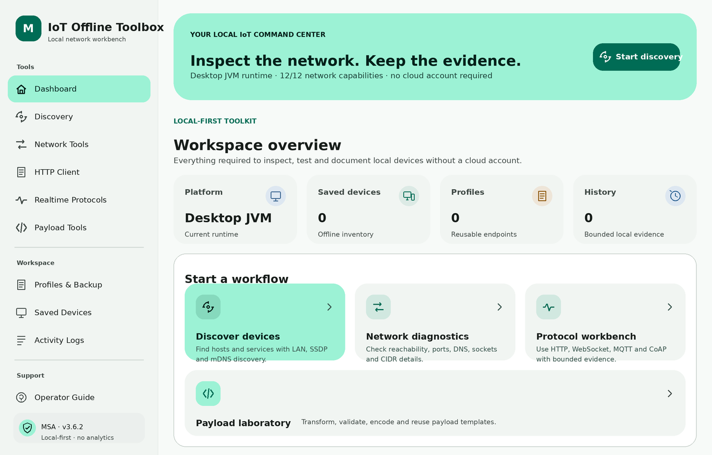

# IoT Offline Toolbox 3.6.2

IoT Offline Toolbox is a local-first Kotlin Multiplatform and Compose Multiplatform workbench for authorized IoT diagnostics, local-network discovery, protocol testing, payload preparation, and offline endpoint inventory.

> **Release status:** Not production-ready. The source is statically hardened and focused runtime harnesses pass, but a full Gradle build, platform runtime, accessibility, signing, and store verification are still required.

<p align="center">
  <a href="docs/screenshots/app-showcase.png">
    
  </a>
</p>

<p align="center"><sub>Source-faithful UI render derived from the current Compose layout, theme, strings, responsive rules, and default Desktop state. It is not labeled as a captured runtime screenshot because full Gradle launch remains unverified in the delivery environment.</sub></p>

This delivery keeps the existing `3.6.2` product and data-contract baseline while moving the Android build profile to a stable toolchain and completing the operator experience without changing package IDs, backend contracts, persistence schema versions, or the selected networking stack. It replaces the partial manual translation layer with Compose Multiplatform resources, expands HTTP and port tooling, and turns settings into a persistent cross-platform control surface.

## Core capabilities

### Discovery and diagnostics

- IPv4 validation, CIDR/subnet calculation, and bounded host enumeration
- Reachability with one overall deadline
- Concurrent bounded TCP port scanning with open, closed, filtered, and error states
- Port ranges, exclusions (`!443`), service aliases, and Web/IoT/Remote/Database/Messaging/Mail presets
- Platform DNS where a resolver is exposed
- LAN probing, SSDP/UPnP, Bonjour/mDNS, and DNS-SD
- Defensive PTR, SRV, TXT, A, and AAAA parsing
- Android multicast-lock lifecycle and interface-aware multicast joins

### Protocol workbenches

- HTTP GET, POST, PUT, PATCH, DELETE, HEAD, and OPTIONS
- Query, header, cookie, Basic/Bearer/API-key authentication, raw/JSON/form bodies, and payload templates
- One shared HTTP validation boundary across UI, Store, and transport; separate request/connect/socket timeout controls where the active Ktor engine supports them
- Bounded response streaming with exact retained bytes, strict UTF-8 classification, formatted text/JSON, HEX and Base64 evidence views, final URL, content type, truncation, and redirect evidence
- Explicit redirect handling with per-hop transport validation and cross-origin credential-leak prevention
- Redacted Bash and PowerShell `curl` previews, request history, sensitive query/body/header protection, and engine-managed header validation
- WebSocket text, HEX, and Base64 frames with bounded transcripts
- MQTT 3.1.1 over WebSocket with strict fixed-header, remaining-length, CONNACK, SUBACK, PUBACK, packet-ID, QoS, UTF-8, fragmentation, keep-alive checks, and bounded binary PUBLISH evidence
- Raw TCP and UDP consoles with explicit timeout/truncation behavior, binary-safe HEX evidence, and prompt JVM socket cancellation
- CoAP GET, POST, PUT, and DELETE over UDP with bounded options, exact response correlation, Content-Format-aware text/binary decoding, and defensive limits

### Local-first workflow

- Saved devices, endpoint profiles, payload templates, history, and logs
- Text, HEX, Base64, JSON, variable expansion, and CRC32 tools
- Versioned backup inspect/merge/replace with pre-write validation and independent best-effort restoration of every persisted snapshot after a write failure
- Corrupt-record quarantine instead of silent fallback
- Central field/count/size limits for direct writes, restored data, and backup imports
- Mandatory redaction before durable or user-visible diagnostic storage
- Public-cleartext override is never enabled by imported backup data

### Adaptive UI

- Centralized MSA Material 3 light/dark design system
- 658 English and 658 Persian Compose Multiplatform string resources with immediate in-app locale switching
- Effective RTL/LTR on Android, iOS, Desktop, JS, and Wasm through platform-specific locale environments
- Drawer for compact portrait, rail for tablets/landscape, sidebar for large windows
- Low-height, split-screen, IME, edge-to-edge, and ultra-wide handling
- Structured loading, disabled, empty, success, warning, error, and cancellation states
- Selectable bounded technical evidence and scroll-safe long output
- Android system-bar icon appearance synchronized with effective system/manual dark mode
- Persistent system theme, manual theme, compact density, RTL, advanced-option visibility, HTTP defaults, scan limits, response limits, retention, and cleartext policy
- Serialized operation coordinator that joins cancelled work before a successor starts and rejects stale state publication

## Platform matrix

| Capability | Android | Desktop JVM | iOS | JS / Wasm browser |
|---|---:|---:|---:|---:|
| Offline tools, inventory, profiles, backup | Yes | Yes | Yes | Yes |
| HTTP | Yes | Yes | Yes | Yes, subject to CORS, browser-managed headers/cookies, and redirect limits |
| WebSocket / MQTT over WebSocket | Yes | Yes | Yes | Yes, without arbitrary custom WebSocket headers in browsers |
| TCP / UDP / CoAP | Yes | Yes | Yes | No: browser sandbox |
| Reachability / port scan / LAN probe | Yes | Yes | Yes | No: browser sandbox |
| Platform DNS lookup | Yes | Yes | Not exposed | No raw resolver |
| SSDP / mDNS | Yes | Yes | Disabled pending signed-device multicast verification | No raw multicast |

## Toolchain baseline

| Component | Version |
|---|---:|
| Kotlin | 2.4.10 |
| Compose Multiplatform | 1.11.1 |
| Android Gradle Plugin | 9.1.0 (stable, fully supported by Kotlin 2.4.10; full build verification still required) |
| Gradle | 9.3.1 |
| Ktor | 3.5.1 |
| kotlinx.coroutines | 1.11.0 |
| kotlinx.serialization | 1.11.0 |
| AndroidX Activity Compose | 1.13.0 |
| Multiplatform Settings | 1.3.0 |
| Android compile / target SDK | 36 |
| Android minimum SDK | 24 |

## Modern architecture

The shared application uses UDF with explicit ports and adapters:

```text
Compose screens -> ToolboxActions -> ToolboxStore facade -> application services -> core/port contracts
                                                                      ^                 ^
                                                        immutable AppState       outer adapters
```

- `ToolboxStore` owns the read-only `StateFlow` and lifecycle; navigation, diagnostics, protocols, payload transformations, device/profile/template inventory, activity journal, settings/backup, and initial-state recovery are separate cohesive services.
- UI code depends on segregated feature intent interfaces rather than the concrete Store or infrastructure adapters.
- Persistence is interface-segregated (`SettingsPersistence`, device/profile/template/activity ports, backup and snapshot-reader contracts); services cannot take the full persistence aggregate unless their use case genuinely needs it.
- Pure HTTP/network/protocol validation lives in `core/policy`; Ktor/socket code in `core/network` consumes policy instead of owning it.
- Persistence and protocol clients implement inward-facing interfaces from `core/port`; concrete adapters and the owned `MainScope` are created only in `ToolboxComposition.kt`.
- Clock and ID generation are injectable, repository timestamps use the same injected clock, state publication uses atomic updates, and platform APIs remain outside `commonMain` application policy.
- `tools/architecture_audit.py` enforces dependency direction, composition-root wiring, facade/service size, persistence interface segregation, policy placement, platform isolation, and required service boundaries.

See [ARCHITECTURE.md](ARCHITECTURE.md) for the complete dependency and lifecycle model.

## Project structure

```text
androidApp/   Android executable, manifest, network policy, resources, and release rules
composeApp/   Shared models, ports, application services, adapters, Compose UI, tests, and target implementations
iosApp/       SwiftUI host and Xcode configuration
.github/      CI and dependency-update definitions
docs/         Verification, compatibility, UI, recovery, and source-integrity documentation
tools/        Architecture/source audits plus reproducible Kotlin runtime and compile harnesses
```

## Verification commands

See [SETUP.md](SETUP.md) for prerequisites.

```bash
# Dependency-free source/configuration/UI audit
bash tools/run_quality_checks.sh --audit

# Audit plus locally compiled current-source Kotlin harnesses
bash tools/run_quality_checks.sh --static

# Desktop/common and Android verification through Gradle
bash tools/run_quality_checks.sh --jvm-android

# JS and Wasm tests/bundles
bash tools/run_quality_checks.sh --web

# Complete supported matrix for the current host
bash tools/run_quality_checks.sh --all
```

`--static` requires `kotlinc`; `--audit` intentionally does not. The complete Gradle matrix requires network access or a populated verified dependency cache. iOS tasks require macOS/Xcode.

## Verification evidence for 3.6.2

- Dependency-free static/configuration/UI audit: **Executed and passed**
- Final deep source/resource/capability audit: **Executed and passed (658/658 live resources)**
- Architecture dependency-direction audit: **Executed and passed**
- Application-service runtime harness: **Executed and passed**
- Store/application-service compile harness: **Executed and passed**
- Persistence-adapter compile harness: **Executed and passed**
- Core transport/payload/redaction harness: **Executed and passed**
- Dedicated custom-secret redaction harness: **Executed and passed**
- MQTT/CoAP/DNS-SD/SSDP protocol harness: **Executed and passed**
- Deterministic protocol fuzz harness: **Executed and passed (110,000 malformed-input cases)**
- Responsive-layout policy harness: **Executed and passed**
- Actual Desktop TCP/UDP loopback and prompt-cancellation implementation harness: **Executed and passed**
- GitHub Actions supply chain: **Pinned to immutable commit SHAs and statically enforced**
- Source checksum manifest: **Regenerated and verified before packaging**
- Final ZIP integrity: **Verified after packaging**
- Full Gradle target compilation: **Blocked before project configuration because this delivery environment cannot resolve `services.gradle.org`**
- Android/iOS/browser visual runtime, signed-device networking, assistive technology, signing, and store upload: **Not executed**

Detailed evidence:

- [Verification matrix](docs/VERIFICATION.md)
- [Stable toolchain and dependency baseline](docs/DEPENDENCY_BASELINE.md)
- [Android Studio and AGP compatibility](docs/ANDROID_STUDIO_AGP_COMPATIBILITY.md)
- [Release checklist](RELEASE_CHECKLIST.md)

## Security and intended use

Use only on systems and networks you own or are explicitly authorized to test. Prefer HTTPS/WSS. Local/private cleartext is allowed with a visible warning because many embedded devices require it. Public cleartext is blocked unless the operator explicitly enables the unsafe override; imported backups cannot enable that override.

Android keeps OS-level cleartext capability for arbitrary local equipment, so the shared application-level `TransportSecurity` policy is a required invariant. Redaction is defense in depth and exported backups must still be reviewed before sharing.

## Gradle sync recovery

If Android Studio reports `Failed building KotlinMPPGradleModel` and the first actionable URL is an injected mirror, use the review-first recovery flow:

```powershell
Set-ExecutionPolicy -Scope Process Bypass
.\tools\show-project-versions.ps1
.\tools\fix-gradle-sync-windows.ps1
```

Apply only after reviewing the reported machine-level Gradle init scripts:

```powershell
.\tools\fix-gradle-sync-windows.ps1 -Apply
```

See [docs/GRADLE_REPOSITORY_RECOVERY.md](docs/GRADLE_REPOSITORY_RECOVERY.md).

## Project documents

- [SETUP.md](SETUP.md)
- [ARCHITECTURE.md](ARCHITECTURE.md)
- [SECURITY.md](SECURITY.md)
- [PRIVACY.md](PRIVACY.md)
- [CONTRIBUTING.md](CONTRIBUTING.md)
- [CHANGELOG.md](CHANGELOG.md)

## Author

Developed and maintained by  
[ALISCHILLER](https://github.com/ALISCHILLER) — **MSA**

Email: [solimaniali90@gmail.com](mailto:solimaniali90@gmail.com)

## License

Apache License 2.0. See [LICENSE](LICENSE).
