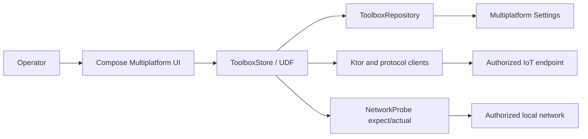

# Architecture

## System context

IoT Offline Toolbox is a local-first operator application. It has no application backend and sends traffic only to the endpoint selected by the operator.



## Architecture style

The project uses pragmatic unidirectional data flow rather than a framework-heavy architecture:

1. Composable screens emit named operator intents.
2. `ToolboxStore` is the sole state mutator and operation owner.
3. Immutable `AppState` is exposed through `StateFlow`.
4. The store delegates persistence to `ToolboxRepository` and network behavior to bounded clients/platform probes.
5. Results are normalized, redacted, and converted into UI state/history/log entries.

This structure keeps protocol logic out of Composables while avoiding interfaces and use cases that would add no current value.

## Modules

```text
androidApp   Android application, manifest, resources, OS network policy, R8 configuration
composeApp   Shared KMP library, Compose UI, domain/data/network logic, platform adapters, tests
iosApp       SwiftUI host and Xcode configuration
```

## Main packages

```text
core/model          immutable requests, responses, settings, capabilities, and backup schema
core/store          UDF orchestration, lifecycle/cancellation, state persistence, history/log policy
core/data           Settings persistence, normalization, corruption quarantine, backup, redaction
core/network        HTTP/WS/MQTT/CoAP clients, codecs, discovery parsers, transport policy
core/payload        encoding, JSON, variables, and CRC32 helpers
ui/layout           shared window classification, navigation mode, density, and sizing policy
ui/components       adaptive and accessible shared components
ui/localization     English/Persian strings and effective RTL policy
ui/screens          diagnostic workbenches
ui/theme            Material 3 design system, typography, shapes, icons, and semantic colors
```

## UI design system and interaction architecture

The UI layer is split into four responsibilities:

1. `ui/theme` defines light/dark Material 3 schemes, semantic status tokens, typography, shapes, and screen icon mapping.
2. `ui/layout` calculates immutable window policy from actual constraints.
3. `ui/components` owns shared visual and interaction primitives such as section cards, status banners, metrics, information pills, selectable evidence surfaces, empty states, and responsive grids/panes.
4. `ui/screens` composes those primitives and emits store intents without owning protocol or persistence logic.

The shell groups navigation by operator intent and selects drawer, rail, or sidebar without changing destinations. Snackbar carries non-blocking notices; a modal dialog is reserved for operation failures. Long technical evidence is bounded, independently scrollable, and selectable. Static metadata is never rendered as a no-op interactive control.

`tools/ui_quality_audit.py` parses the actual theme source, computes WCAG contrast for semantic foreground/background pairs, and enforces UI source contracts. It is a source gate, not a screenshot or assistive-technology runtime test. Detailed decisions and the required visual matrix are in `docs/UI_UX_DEEP_REDESIGN.md`.

## Responsive window architecture

The UI reads current Compose window constraints and creates one immutable `ResponsiveLayoutInfo` for the active composition. Device model names are not used. Compact, medium, expanded, orientation, and low-height properties select drawer, navigation rail, or sidebar shells and feed shared spacing/sizing tokens. Inner field, card, button, and pane components also measure their own container width so navigation chrome, split-screen, and resizable windows cannot force an invalid column count.

Android rail/sidebar shells consume safe-drawing insets because the Android host enables edge-to-edge. Mobile Scaffold/drawer modes retain Material inset handling. Ultra-wide content is centered and capped, while short wide windows fall back from the sidebar to a scrollable icon-first rail. See `docs/RESPONSIVE_IMPLEMENTATION.md`.

## Dependency direction

```text
UI -> Store -> Repository / Network abstractions
                    |
                    -> pure codecs and validators
Platform actuals -> NetworkProbe contract
```

`commonMain` does not depend on Android SDK or UIKit. Platform source sets implement only platform-specific engine, socket, multicast, and host integration behavior.

## Source sets and targets

- `commonMain`: models, state, repository, codecs, Ktor clients, localization, and Compose UI
- `androidMain`: OkHttp, Java sockets, Android multicast lock, Android entry integration
- `desktopMain`: CIO, Java sockets, Desktop entry point
- `iosMain`: Darwin engine, Ktor Network TCP/UDP, UIKit integration
- `jsMain` / `wasmJsMain`: browser engine and explicit capability-limited probe
- `commonTest`: protocol, persistence, security, parser, and HTTP tests
- `desktopTest`: actual Desktop TCP/UDP loopback integration tests

## State and lifecycle

`ToolboxStore` owns a `SupervisorJob`, active operation job, state flow, and operation cancellation. Navigation selection is persisted as `lastScreen`. Inputs remain screen-local unless they are durable settings, profiles, devices, templates, or results.

Android process-death restoration of unfinished form fields is not implemented in 3.6.0. Durable application state is restored from `Multiplatform Settings`; in-flight operations are intentionally not resumed.

## Networking

- Ktor provides HTTP and WebSocket transports with platform engines.
- The HTTP workbench uses one shared validator from UI through Store to transport, builds query/header/cookie/auth/body requests in shared code, applies a total timeout budget plus engine-supported connect/socket limits, retains bounded exact response bytes, classifies strict UTF-8 versus binary payloads, and follows redirects manually so every hop is revalidated.
- Automatic engine redirects remain disabled on every target; credential-bearing requests cannot cross origins through redirects.
- MQTT 3.1.1 is encoded/decoded in shared code and transported over WebSocket.
- CoAP, TCP, UDP, reachability, port scanning, LAN probing, SSDP, and mDNS use `NetworkProbe` platform implementations.
- Every public operation has bounded input, output, count, concurrency, and timeout parameters.
- Unsupported browser/iOS capabilities return controlled capability results.

## Transport security model

`TransportSecurity` evaluates HTTP/WS endpoints before a client starts:

- HTTPS/WSS: allowed
- local/private cleartext: allowed with warning
- public cleartext: blocked by default
- explicit unsafe override: allowed with warning

Android must permit cleartext at the OS layer to reach embedded LAN devices, so application-level enforcement is a required invariant and is covered by shared tests.

## Persistence and recovery

Multiplatform Settings stores bounded JSON collections. Decode failure does not silently become empty state. The repository:

1. captures a redacted preview;
2. writes it to a deterministic quarantine key;
3. returns a safe fallback;
4. exposes a one-time recovery event to the store/UI.

Backup schema version 4 supports inspect, merge, and replace. Import validates and bounds the entire document before the first durable write. If any write fails, every previous snapshot is restored through an independent best-effort action so one failed rollback write does not skip the remaining collections. Merge preserves the local item on ID collision.

## Error model

Expected validation/capability failures are returned as user-readable results. Cancellation is not logged as an operation failure. Unexpected errors are redacted before durable logging. The application does not expose raw credentials in exception/history paths.

## Localization and accessibility

Generated Compose Multiplatform resources supply 704 English and 704 Persian strings from `commonMain/composeResources`. `LocalAppLocale` uses expect/actual implementations for Android, iOS, Desktop, and shared web targets, while `AppLocaleEnvironment` forces resource recomposition when the selected language changes. Persian automatically enables effective RTL, while an explicit RTL override remains available.

Primary screens use adaptive field/action arrangements, responsive cards/panes, scrollable translated tabs, compact-density support, and low-height behavior. Non-text controls have semantic labels, page/section headings are exposed, and active-operation feedback uses a live region.

TalkBack, VoiceOver, text scaling, keyboard navigation, and contrast still require platform runtime verification before release.

## Testing strategy

- pure common tests for parsers, codecs, validation, security, transport policy, and persistence
- Ktor MockEngine tests for HTTP behavior
- Desktop loopback tests for actual TCP/UDP implementation
- CI target tasks for Android, Desktop/shared, JS, Wasm, and iOS simulator
- deterministic UI source/contrast checks
- mandatory manual physical-device checks for Android/iOS multicast, local-network permissions, visual states, and assistive technology

## CI/CD and deployment

CI defines static audit, wrapper validation, dependency review, Desktop/shared tests, Android debug/release/lint/unit tasks, browser tests/bundles, and iOS simulator tests/framework linking. Workflow presence is not proof of a successful run; release approval requires green runs from a fresh checkout.

Signing credentials, store accounts, and distribution certificates remain outside the repository. The source archive is not production-ready and is not a signed store artifact; full Gradle and platform release gates remain required.

## Trade-offs and known limitations

- key-value JSON storage is appropriate for the bounded local inventory; no relational database is introduced
- no automatic cloud sync or multi-user separation
- low-level protocol/server diagnostic text may remain in its original technical language; navigation, controls, help, settings, and application-owned UI copy are localized
- no raw-socket browser support
- iOS SSDP/mDNS disabled pending signed physical-device verification
- no MQTT QoS 2, raw MQTT TLS, CoAP DTLS/Observe/block-wise transfer
- no certificate pinning or custom trust store
- unfinished form fields are not restored after process death
- complete platform builds remain a release gate

## Future improvements

- signed-device Android/iOS integration test suite
- Compose UI tests for RTL, accessibility, restoration, and adaptive layouts
- release signing workflow and store metadata validation
- optional secure platform credential aliases without exporting secret values
- protocol interoperability fixtures for representative devices

## Author

Developed and maintained by  
[ALISCHILLER](https://github.com/ALISCHILLER) — **MSA**

Email: [solimaniali90@gmail.com](mailto:solimaniali90@gmail.com)


### Platform capability boundaries from the 2026-07-20 re-audit

- HTTP request, connect, and socket timeouts are modeled separately, but the UI/store expose only controls supported by the current platform engine.
- Browser targets do not permit arbitrary raw-socket tools, browser-forbidden request headers, manual `Cookie` headers, or arbitrary WebSocket handshake headers.
- Cross-origin redirects carrying authentication, cookie, API-key, or custom secret headers are rejected by the shared request boundary.
- Secret redaction is mandatory and is not a user-disableable setting.
- Android keeps OS-level cleartext capability for local embedded equipment; shared `TransportSecurity` remains the mandatory application boundary.
